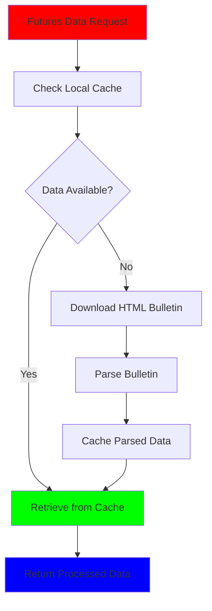

# 🇧🇷 brfutures 📈

> **Efficiently download and cache daily OHLCV futures data from Brazil's B3 exchange** 🇧🇷

<p align="center">
  <a href="https://cran.r-project.org/">
    
  </a>
  <a href="https://github.com/hugorteixeira/brfutures">
    
  </a>
  <a href="https://opensource.org/licenses/GPL-3.0">
    
  </a>
  <a href="https://www.r-project.org/">
    
  </a>
</p>

---

## 🌟 Overview

**brfutures** is a lightweight R package that provides efficient helpers to keep a local cache of B3 (BM&F) futures bulletins. The package uses only the public HTML endpoint and includes several smart features:

- ⚡ **Fast updates**: Parse bulletins as soon as they're downloaded
- 🗂️ **Smart caching**: Skip "no data" pages immediately  
- 🔄 **Incremental merge**: Add fresh data to cached RDS files incrementally
- 🚀 **Performance**: Keep large refreshes fast with efficient data handling

---

## 📦 Installation

### Development Version
```r
# Install remotes if not already installed
if (!requireNamespace("remotes", quietly = TRUE)) {
  install.packages("remotes")
}

# Install from GitHub
remotes::install_github("hugorteixeira/brfutures")
```

---

## 🚀 Quick Start

### 1. Set up your cache directory 📁
```r
# Choose a writable cache location
options(brfutures.cache_dir = "~/data/brfutures")
```

### 2. Update your cache with futures data 📥
```r
library(brfutures)

# Update data for a specific futures root (e.g., WIN futures)
update_brfut(
  root = "WIN",
  start = as.Date("2024-01-01"),
  end = Sys.Date()
)
```

### 3. Retrieve your cached data 📊
```r
# Get data for individual contract(s)
get_brfut("WINM24")

# Get aggregate data for all cached roots between dates
# (defaults to the `clean_data` treatment, which normalizes columns)
get_brfut_agg(start = "2024-03-01", end = "2024-04-01")

# Drop rows where OHLC/volume fields are zero or missing
get_brfut_agg(treatment = "clean_data_drop0")
```

### 4. Build continuous futures series 📈
```r
# Get the aggregate data for a specific period
data <- get_brfut_agg(start = "2024-01-01", end = "2024-06-01")

# Build backward-adjusted continuous series (preserves current price levels)
# This scales past history whenever a roll occurs (Panama method)
backward_series <- build_backward_adjusted(
  data = data,
  root = "WIN",
  days_before_roll = 5
)

# Build forward-adjusted continuous series (preserves early history)
# This scales forward contracts to avoid price gaps
forward_series <- build_forward_adjusted(
  data = data,
  root = "WIN", 
  days_before_roll = 5
)
```

The continuous futures functions support:
- **Backward adjustment**: Maintains current price levels by scaling historical data
- **Forward adjustment**: Preserves early history by scaling future contracts  
- **Custom roll schedules**: Adjust how many days before maturity to roll
- **Maturity filtering**: Select specific months (e.g., "F", "G", "H") or use all
- **Multi-root support**: Include additional roots for historical continuity

---

## 🏗️ Package Architecture



---

## 📁 Cache Structure

The package organizes your data efficiently:

```
<cache_dir>/
├── 📂 WIN/
│   ├── 📄 raw/                # Downloaded HTML bulletins (no-data files removed)
│   └── 📊 WIN.rds             # Parsed rows for the root, updated incrementally
└── 📊 aggregate.rds           # Quick access to every cached row
```

### Key Features:
- 🔒 `update_brfut()` never downloads Excel files and never touches the network when the cache already contains the requested sessions
- 🔄 If `root` is omitted, the function updates every root that already has a folder inside the cache directory
- 📅 Passing `start = NULL` resumes from the first day not yet cached for each root and defaults `end` to `Sys.Date()`

---

## 📥 Data Retrieval

- `get_brfut()` and `get_brfut_agg()` always read from the aggregate RDS file
- 💾 Keep the original bulletin columns for full data fidelity
- 🛠️ `get_brfut()` lets you transform the data on the fly via the `treatment` argument:
  - Raw data frames
  - Renamed tibbles  
  - Ready-to-use OHLCV `xts` objects

If you need to rebuild the aggregate separately after a huge update, use `update_brfut_agg()` — by default it simply refreshes the aggregate from the already-parsed roots, finishing in seconds even after thousands of downloads.

---

## 🧪 Testing

The package includes a comprehensive test suite based on synthetic HTML fixtures:

```r
# Load the package and run tests
pkgload::load_all()
testthat::test_dir("tests/testthat")
```

---

## 🤝 Contributing

Contributions are welcome! Feel free to:
- 🐛 Open issues for bugs you find
- 💡 Suggest new features
- 🔄 Submit pull requests

---

### Code of Conduct
Please note that the brfutures project is released with a [Contributor Code of Conduct](https://www.contributor-covenant.org/version/2/1/code_of_conduct/). By contributing to this project, you agree to abide by its terms.

---

## 📄 License

GPL (≥ 3) – share, remix, and improve responsibly.

---

## 👨‍💻 About the Author

Hi, I'm Hugo. I build tools around trading and backtesting in R to streamline workflow and help iterate on strategies faster. If you find brfutures useful (or frustrating!), feedback is welcome.

---

## 🙏 Acknowledgments

- Data provided by B3 (Brasil, Bolsa, Balcão)
- Built with R and the greater open-source ecosystem
- Special thanks to the Brazilian financial market community

---

<p align="center">
  Made with ❤️ for the Brazilian financial market
</p>
