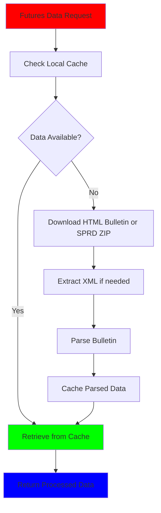

# 🇧🇷 brfutures 📈

> **Efficiently download and cache daily OHLCV futures data from Brazil's B3 exchange** 🇧🇷

<p align="center">
  <a href="https://cran.r-project.org/">
    
  </a>
  <a href="https://github.com/hugorteixeira/brfutures">
    
  </a>
  <a href="https://opensource.org/licenses/GPL-3.0">
    
  </a>
  <a href="https://www.r-project.org/">
    
  </a>
</p>

---

## 🌟 Overview

**brfutures** is a lightweight R package that provides efficient helpers to keep a local cache of B3 (BM&F) futures bulletins. The package supports the legacy HTML endpoint and the newer BVBG XML reports (downloaded via the pesquisapregao SPRD ZIP endpoint), switching automatically at a configurable cutover date (defaults to 2025-12-16).

- ⚡ **Fast updates**: Parse bulletins as soon as they're downloaded
- 🔄 **Dual source support**: HTML before the cutover, BVBG XML after it
- 🗂️ **Smart caching**: Skip "no data" HTML/XML/ZIP days immediately
- 🔄 **Incremental merge**: Add fresh data to cached RDS files incrementally
- 📐 **DI helpers**: Delegate rate/PU math to `positionsizer`
- 🚀 **Performance**: Keep large refreshes fast with efficient data handling

`brfutures` still owns B3 futures data download, cache, treatments, maturity
resolution, and continuous-contract construction. The public DI conversion
helpers remain available here for compatibility, but the formula itself is
centralized in `positionsizer`.

BIT metadata is date-aware: the daily kernel is linear in BRL, the contract
size changes from `0.1` to `0.01` BTC on 2025-06-16 with the corresponding
ten-for-one administrative position conversion, and expiry identifies the
separate `NQBTCS × official B3 BRL/USD` terminal-settlement kernel. The raw
official index and FX observations remain required inputs; no close-price
fallback is permitted.

The source boundary is explicit. `brf_b3_contract_lifecycle_fetch()` owns the
official `INyymmdd.zip`/BVBG.028 collection. It keeps the compressed archive,
extracts snapshots sequentially with bounded temporary disk, and returns
either the newest official `AppHdr/CreDt` view or every causal revision with
`latest = FALSE`. Its lifecycle reader scans bounded `BizGrp` blocks and never
constructs a DOM for the hundreds-of-megabytes BVBG.028 file.
`brf_b3_settlements_fetch()` owns historical
`SPRDyymmdd.zip`/BVBG.187 settlement rows even before the normal XML cutover,
without changing that global source rule. `brf_b3_indicators_fetch()` owns the
`IDyymmdd.ex_`/`Indic.txt` collection and retains immutable, content-addressed
availability manifests instead of overwriting earlier evidence. All outputs identify
`brfutures_b3_bit_sources_v2` and retain content SHA-256 provenance. Version 2
requires the settlement-specific causal clock carried from the same
BVBG.187 message as `AdjstdQt`; version 1 rows must be rebuilt from retained
official sources before exact execution.
Because `Indic.txt` has no embedded publication timestamp, a new historical
fetch requires externally evidenced `available_at` and fails closed without
it. `brf_b3_bit_terminal_assemble()` then reconciles final BVBG.187 `AdjstdQt`,
`BTCLIQUSD × RTDOL-D1` rounded half-up to two decimals, and `RTBITLIQ`.

These helpers only prove the terminal source inputs. Their assembled rows are
deliberately marked `execution_supported = FALSE`; no execution engine may
infer exact BIT support merely because the source reconciliation succeeds.

---

## 📦 Installation

### Development Version
```r
# Install remotes if not already installed
if (!requireNamespace("remotes", quietly = TRUE)) {
  install.packages("remotes")
}

# Install from GitHub
remotes::install_github("hugorteixeira/brfutures")
```

---

## 🚀 Quick Start

### 1. Set up your cache directory 📁
```r
# Choose a writable cache location
options(brfutures.cache_dir = "~/data/brfutures")
```

### 2. Update your cache with futures data 📥
```r
library(brfutures)

# Update data for a specific futures root (e.g., WIN futures)
update_brfut(
  root = "WIN",
  start = as.Date("2024-01-01"),
  end = Sys.Date()
)

# Dates before 2025-12-16 use HTML; on/after use BVBG XML.
# Override the cutover date if needed:
# options(brfutures.xml_cutover_date = "2025-12-16")
```

### 3. Retrieve your cached data 📊
```r
# Get data for individual contract(s)
get_brfut("WINM24")

# Return xts indexed at local midnight (default tz = America/Sao_Paulo)
get_brfut("WINM24", keep_time = TRUE)

# Get aggregate data for all cached roots between dates
# (defaults to the `clean_data` treatment, which normalizes columns)
get_brfut_agg(start = "2024-03-01", end = "2024-04-01")

# Drop rows where OHLC/volume fields are zero or missing
get_brfut_agg(treatment = "clean_data_drop0")

# DI1 daily adjustments need official settlement fields, not naive PU diffs.
# This keeps `settlement_price` and computes the B3 adjustment base:
get_brfut_di_adjustments("DI1F26", start = "2023-11-10", end = "2024-01-10")
```

The DI1 adjustment contract deliberately keeps the exchange fields separate:

| `brfutures` field | Meaning |
| --- | --- |
| `settlement_price` | current B3 settlement price in PU |
| `previous_settlement` | raw B3 legacy/XML field; its row meaning depends on the source regime below |
| `corrected_settlement` | raw legacy HTML `AJUSTE CORRIG.` field; its row meaning changed historically |
| `change_points` | raw legacy HTML `VAR. PTOS.` field; normally official margin points, except in the corrected-base regime below |
| `di_adjustment_base` | canonical base used to reconcile the current adjustment |
| `di_adjustment_points` | canonical per-contract current adjustment in PU points |

Legacy HTML has three proven rows where a contract traded, with positive
`trade_count`, contract quantity, VWAP, settlement PU, and closing bid/ask, but
the bulletin published four literal zero OHLC values. The
`di_adjustments` treatment repairs only this exact evidence pattern. It models
the target contract's prior-session OHLC move from two liquid neighbouring
maturities, calibrates the bar to the reported target VWAP, and anchors close
to the rate implied by the official settlement PU. Non-traded zero rows,
partial quotes, and unsupported inputs remain untouched.

Every repaired row is explicitly non-observed and carries `ohlc_repaired`, the
versioned `ohlc_repair_method`, status, source contracts, neighbour mode, prior
session date, and the four original OHLC values. The raw cached B3 bulletin is
never rewritten. This is a narrow source-quality repair, not LOCF or a general
missing-bar model.

The raw HTML cache proves three deterministic layouts despite unchanged column
labels:

| B3 source interval | Canonical base and points |
| --- | --- |
| through 2018-09-21 | `change_points` is authoritative; `base = settlement_price - change_points` |
| 2018-09-24 through 2019-06-28 | `previous_settlement` is the uncorrected prior `PAt`; `corrected_settlement` carries that quote into the current session; `base = corrected_settlement`, `points = settlement_price - base` |
| from 2019-07-01 through the HTML cutover | `change_points` is authoritative again; the two previous/corrected fields normally contain the same current base |
| BVBG XML from 2025-12-16 | `PrvsAdjstdQt` is the current adjusted base; `points = settlement_price - previous_settlement` |

In the middle interval, a small number of contract-launch and expiry rows put
the next-session corrected quote in the raw corrected column. `brfutures`
recovers the common daily carry factor from at least three maturities in the
same full DI1 bulletin and applies it to the raw prior `PAt`; a partial input
without that cross-sectional consensus fails closed. The resulting provenance
is `official_corrected_adjusted_quote`. Regime normalization does not overwrite
raw `previous_settlement`, `corrected_settlement`, or `change_points`; the
explicit exception is the proven same-row power-of-ten source repair described
below.

Outside that bounded interval, legacy HTML `di_adjustment_points` preserves the
B3-reported `change_points` and derives its reconciled base from the same row.
When that field is unavailable (including BVBG XML rows), the fallback is:

```text
settlement_price - previous_settlement
```

`CorrectedSettlement` is consequently diagnostic outside the bounded
corrected-base interval and must never participate in a global lag invariant.
The executable contract is only the same-row identity
`di_adjustment_points = settlement_price - di_adjustment_base`, together with
official/final provenance.

Settlement-scale typos are repaired only when another same-row DI settlement
field proves a plausible power-of-ten mismatch. Values at or slightly above
100,000 are valid near maturity and must not be capped merely because of their
size.

This split follows the B3 contract: DI1 is quoted as an annualized rate, its
economic price is PU, and positions receive daily adjustments as the PU is
updated by the DI carry factor. See the official
[DI1 contract specification](https://www.b3.com.br/pt_br/produtos-e-servicos/negociacao/juros/futuro-de-taxa-media-de-depositos-interfinanceiros-de-um-dia.htm)
and the current
[B3 futures pricing manual](https://www.b3.com.br/data/files/19/52/89/BE/85C589100A29E189AC094EA8/Manual%20de%20Aprecamento%20-%20Futuros%20-%20V58.pdf).

Ownership is also explicit: `brfutures` parses and normalizes the B3 fields;
`finharvest` materializes and routes them; `positionsizer` owns pure DI
rate/PU and adjustment P&L mathematics; a portfolio or backtest engine applies
the resulting adjustment exactly once per contract and trading session.

### Optional BVBG XML settings
```r
# Use a browser-like user-agent if the SPRD ZIP endpoint blocks other clients
options(brfutures.bvbg_user_agent = "Mozilla/5.0 (X11; Linux x86_64) AppleWebKit/537.36 (KHTML, like Gecko) Chrome/120.0.0.0 Safari/537.36")

# Point to a local XML file or directory to avoid downloads
options(brfutures.bvbg_xml_path = "~/Downloads")
```

### 4. Build continuous futures series 📈
```r
# Get generic aggregate data for a specific period
data <- get_brfut_agg(start = "2024-01-01", end = "2024-06-01")

# DI continuous data must preserve the official settlement contract and the
# contracts-traded field; generic clean_data intentionally drops those fields.
di_data <- get_brfut_agg(
  start = "2024-01-01",
  end = "2024-06-01",
  root = "DI1",
  treatment = "di_adjustments"
)

# Build backward-adjusted continuous series (preserves current price levels)
# This scales past history whenever a roll occurs (Panama method)
backward_series <- build_backward_adjusted(
  data = data,
  root = "WIN",
  days_before_roll = 5
)

# Build forward-adjusted continuous series (preserves early history)
# This scales forward contracts to avoid price gaps
forward_series <- build_forward_adjusted(
  data = data,
  root = "WIN", 
  days_before_roll = 5
)

# Integer yearly January series use a calendar horizon by default.
di_3y <- build_continuous_di(
  data = di_data,
  target_tenor = 3,
  tenor_unit = "years",
  allowed_maturities = "F",
  strict_target = TRUE,
  include_pnl = TRUE
)

# Build the serializable daily bundle used by an execution engine. The
# synthetic series remains signal-only; cash P&L uses the real contract's
# official PU adjustment through positionsizer::ps_di_session_settlement().
di_3y_bundle <- build_continuous_di_bundle(
  data = di_data,
  target_tenor = 3,
  tenor_unit = "years",
  allowed_maturities = "F",
  synthetic_ticker = "DI1FUT_3Y_F"
)
```

The continuous futures functions support:
- **Backward adjustment**: Maintains current price levels by scaling historical data
- **Forward adjustment**: Preserves early history by scaling future contracts  
- **Custom roll schedules**: Adjust how many days before maturity to roll
- **Maturity filtering**: Select specific months (e.g., "F", "G", "H") or use all
- **Multi-root support**: Include additional roots for historical continuity

### Exact daily B3 continuous clock contract

`build_continuous_bundle()` schema v4 keeps adjusted prices signal-only and
carries observed causal clocks for real-contract rows when the source proves
them.
`available_at` identifies when the complete official row was available and
`settlement_available_at` identifies when its official settlement was
available. Supplied clocks must be `POSIXct` vectors explicitly tagged UTC;
an observed value may not precede the session, and
`settlement_available_at <= available_at`.

For BVBG.187 XML, both clocks are the official `AppHdr/CreDt` of the same
`BizGrp` that contains `PricRpt/FinInstrmAttrbts/AdjstdQt`. Their equality is
therefore observed source evidence, not an assumed market close. The parser
materializes both fields and the bundle carries them into `contract_map` and
raw `execution_data`. Legacy HTML has no equivalent publication evidence, so
both fields remain typed `NA`; the builder never invents midnight or an
end-of-day timestamp. This does not remove the economically exact daily
session-phase engine used for the 2011+ history:
`daily_session_phase_execution_supported` remains independent of wall-clock
evidence. Instead, `observed_clock_complete` and
`heterogeneous_same_close_supported` fail closed. A `Date` supplied as if it
were a timestamp is rejected.

The official historical `SPRDyymmdd.zip` archive fills this clock contract
from 2021-11-16 onward in the dates audited here, but returns an empty ZIP for
older probes including 2015-01-05, 2020-01-02, 2021-01-04, 2021-07-01 and
2021-11-12. Therefore the package does not pretend that a full 2011+ wall
clock can be reconstructed from that endpoint.

### DI selection and roll safety contract

`build_continuous_di_bundle()` is the durable daily execution transport. It
serializes the adjusted `signal_series` separately from `execution_series`,
`di_continuous_contracts`, full `di_roll_events`, `official_sessions`,
versioned `contract_specs`, modelled `cost_models`, provenance, row counts,
and SHA-256 fingerprints. DI1 uses `pnl_formula_id = "di1_official_pu"`:
rates are signal coordinates, while real fills, settlement and P&L use raw PU
in BRL with a point multiplier of one.

The bundle never fabricates an adjustment publication time or an intraday roll
clock. `adjustment_available_at` is populated only from a timestamp present in
the official source row. If any required timestamp, final adjustment, or
provenance row is missing, the bundle remains valid for signals but its
manifest sets `execution_supported = FALSE` and lists the blockers. Roll events
carry session order and both real-contract legs; their informational PU gap has
`roll_gap_pnl = 0`. Configured fees and slippage are versioned and explicitly
labelled as modelled rather than observed exchange costs.

`build_continuous_di()` is deliberately stricter than a generic continuous
future. With `selection_mode = "auto"`, an integer yearly tenor restricted to
January (`allowed_maturities = "F"`) is a calendar-horizon series: session `D`
in calendar year `Y` selects the real contract whose actual January maturity is
in `Y + N`. Thus 3Y uses F27 throughout official 2024 observations and changes
to F28 on the first observed 2025 session. DU remains a row-level risk
diagnostic; it is not the selection boundary in this mode.

All other configurations retain `strict_du_floor`: the closest contract at or
above the requested DU tenor is selected and actual maturity may never move
backward. `selection_mode = "strict_du_floor"` explicitly reproduces the old
yearly-January behavior. In this legacy rule, setting `strict_target = FALSE`
opts into the longest available monotonic contract below target.

Both modes may discard an initial prefix with no eligible contract. After the
first selection, a missing monotonic target fails closed unless the explicit
suffix-restart coverage policy is used. A roll exists only when the selected
contract symbol changes; no separate maturity-date trigger can create a second
January roll. A roll also aborts unless both contracts have a common, finite
rate/PU bridge on or before the switch date. `continuous_spec` stores the
resolved `selection_mode`, `selection_version`, actual-maturity contract, and
roll trigger.

For sparse historical grids, `coverage_mode = "restart_strict_suffix"` is a
separate, explicit `strict_target = TRUE` policy. At an internal gap it discards
the earlier prefix, resets the monotonic-maturity state, and re-evaluates that
same session as a fresh start. If the session still has no contract at or above
target it is dropped, and the process continues until the final greedy strict
suffix is found. `attr(x, "continuous_spec")` records `coverage_start`,
`coverage_end`, and every `gap_resets` decision. Roll bridges are searched only
inside the retained suffix, so discarded history cannot make the published
suffix appear executable. A missing in-suffix bridge still aborts.

Selection is deterministic even when providers repeat a
`(date, ticker, maturity)` row. Economically identical copies collapse to one
canonical quote regardless of input order or textual source/provenance;
different OHLC, volume, interest, bid/ask, reference, or settlement values for
the same key abort the build instead of choosing an arbitrary row.

DI maturity and DI tenor use two deliberately different calendars. A ticker's
maturity is the first B3 trading session of its contract month; it must not be
estimated from weekdays alone. Once that date is known, DI DU follows the
contract's national financial-market day definition: the operation date is
inclusive and the maturity date is exclusive, using the ANBIMA financial
calendar. For example, 2018-01-25 counts as financial DU even though B3 had no
trading session. With that financial calendar,
`bizdays::bizdays(session_date, maturity_date)` already has exactly that
cardinality; no extra basis day is added. The public
`include_basis_day = TRUE` option remains only for explicit legacy
compatibility and is not the official DI1 convention.

The built-in `bizdays` B3 calendar currently ends in 2025. For maturities
after that observed coverage, `brfutures` preserves every historical B3
holiday through the cutoff and projects later exchange closures from the
longer ANBIMA calendar. This is only a deterministic future-maturity fallback:
observed session completeness and official settlement availability still come
from the B3 sidecar, never from the projected calendar.

This calendar answers only the PU-exponent question. Whether an official
settlement session exists, and when it becomes available, comes from the B3
settlement sidecar. Continuous research series must not manufacture a session
or an official adjustment from the financial-DU calendar.

The current DI1 tick regime is effective from 2025-08-18. Contracts above
three months use a `0.005` percentage-point tick; the former `0.010` tick above
60 months is retained only for historical dates before that boundary.

Every output row carries the executable contract context numerically:

- `ContractOrdinal`, mapped to `contract_symbol` by `attr(x, "contract_map")`;
- `ActualMaturity`, encoded as days since `1970-01-01`, and `ValidDays`;
- raw `Rate*Raw` and `PU*Raw` OHLC fields, even when the primary OHLC is
  backward-adjusted for research;
- `Settlement`, `PreviousSettlement`, `AdjustmentBase`,
  `OfficialAdjustment`, and `AdjustmentOfficial` from the selected real
  contract.

`attr(x, "active_contracts")` retains both `ticker` and `contract_symbol` for
each row. `ActualMaturity` is the canonical row-level maturity for execution,
sizing, and serialization. The scalar `attr(x, "maturity")` is retained only
for backward compatibility and is an estimated target maturity; it must not be
used as the selected contract maturity.

Before B3 publishes the official settlement after its 16:10--16:20 VWAP
window, an operator can compose the existing pure
helpers without inventing an official value:

```r
estimated <- positionsizer::ps_di_rate_to_pu(
  current_rate,
  maturity_date = maturity,
  basis_date = session_date,
  include_basis_day = FALSE,
  snap_to_tick = FALSE
)
estimated_adjustment <- positionsizer::ps_di_adjustment_points(
  estimated$pu,
  AdjustmentBase
)
```

Once the prior official settlement and every applicable published DI factor
are available, `AdjustmentBase` can be known before the close. The current
`PAt` cannot: the current rate converted to PU is only an intraday mark, while
the B3 may use the closing-window VWAP, valid bid/ask fallbacks, interpolation,
or arbitration. Therefore `estimated$pu` and `estimated_adjustment` remain
estimates and become official only when B3 publishes the session's final
adjustment price. A breakout rate determines a rate/PU fill independently; it
does not determine the official settlement.

When `include_pnl = TRUE`, `PU_pnl` remains an approximate continuous PU mark,
identified by `attr(x, "PU_pnl_is_approximate")`. It is not official B3 daily
variation margin. Cash settlement must use the row-level official adjustment
fields for the real selected contract. Those fields are necessary but are not
by themselves sufficient on a roll session: carry may still belong to the old
contract while the session operation opens the new one. The executor must keep
a ledger keyed by `(session, contract_symbol)`, close the old contract, open the
new contract, and apply transaction costs to both legs. The continuous series
must never be treated as one synthetic liquidable contract.

---

## 🏗️ Package Architecture


```mermaid
graph TD
    A[Futures Data Request] --> B[Check Local Cache]
    B --> C{Data Available?}
    C -->|Yes| D[Retrieve from Cache]
    C -->|No| E[Download HTML Bulletin or SPRD ZIP]
    E --> F[Extract XML if needed]
    F --> G[Parse Bulletin]
    G --> H[Cache Parsed Data]
    H --> D
    D --> I[Return Processed Data]
    
    style A fill:#FF0000
    style D fill:#00FF00
    style I fill:#0000FF
```

---

## 📁 Cache Structure

The package organizes your data efficiently:

```
<cache_dir>/
├── 📂 WIN/
│   ├── 📄 raw/                # Downloaded HTML bulletins
│   ├── 📊 parsed/             # Parsed HTML per day (RDS)
│   └── 📊 WIN.rds             # Parsed rows for the root, updated incrementally
├── 📂 BDI/
│   └── 📂 BVBG/
│       └── 📂 2026/
│           ├── 📄 2026-01-08-raw.xml
│           ├── 📊 2026-01-08-parsed.rds
│           └── 📊 2026.rds
├── 📄 no-data-html.csv
├── 📄 no-data-xml.csv
├── 📄 no-data-zip.csv
└── 📊 aggregate.rds           # Quick access to every cached row
```

### Key Features:
- 🔒 `update_brfut()` never downloads Excel files and never touches the network when the cache already contains the requested sessions
- 🔄 If `root` is omitted, the function updates every root that already has a folder inside the cache directory
- 📅 Passing `start = NULL` resumes from the first day not yet cached for each root and defaults `end` to `Sys.Date()`

---

## 📥 Data Retrieval

- `get_brfut()` and `get_brfut_agg()` always read from the aggregate RDS file
- ✅ The `source` column marks whether each row came from HTML (`html`) or BVBG XML (`xml`)
- 💾 Keep the original bulletin columns for full data fidelity
- 🛠️ `get_brfut()` lets you transform the data on the fly via the `treatment` argument:
  - Raw data frames
  - Renamed tibbles  
  - Ready-to-use OHLCV `xts` objects

If you need to rebuild the aggregate separately after a huge update, use `update_brfut_agg()` — by default it simply refreshes the aggregate from the already-parsed roots, finishing in seconds even after thousands of downloads.

---

## 🧪 Testing

The package includes a comprehensive test suite based on synthetic HTML and BVBG XML fixtures:

```r
# Load the package and run tests
pkgload::load_all()
testthat::test_dir("tests/testthat")
```

---

## 🤝 Contributing

Contributions are welcome! Feel free to:
- 🐛 Open issues for bugs you find
- 💡 Suggest new features
- 🔄 Submit pull requests

---

### Code of Conduct
Please note that the brfutures project is released with a [Contributor Code of Conduct](https://www.contributor-covenant.org/version/2/1/code_of_conduct/). By contributing to this project, you agree to abide by its terms.

---

## 📄 License

GPL (≥ 3) – share, remix, and improve responsibly.

---

## 👨‍💻 About the Author

Hi, I'm Hugo. I build tools around trading and backtesting in R to streamline workflow and help iterate on strategies faster. If you find brfutures useful (or frustrating!), feedback is welcome.

---

## 🙏 Acknowledgments

- Data provided by B3 (Brasil, Bolsa, Balcão)
- Built with R and the greater open-source ecosystem
- Special thanks to the Brazilian financial market community

---

<p align="center">
  Made with ❤️ for the Brazilian financial market
</p>
